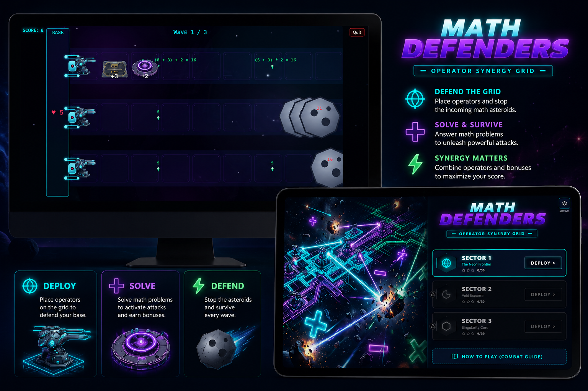

<div align="center">



# 🛡️ Math Defenders

**A landscape, mobile-friendly math tower-defense for grades 3–5.**
Plant operator stations along the lanes, compose the operations, and out-math the drones
before they reach your base.

[**▶ Play the demo**](https://math-defender.pages.dev) · [Report a bug](https://github.com/jbotmallen/math-defender/issues)

*Built as a rapid, AI-first prototype for the Sports Academy Games take-home challenge.*

</div>

---

## Table of contents

- [What it is](#what-it-is)
- [How to play](#how-to-play)
- [Why it teaches math](#why-it-teaches-math)
- [Game systems](#game-systems)
- [Tech stack](#tech-stack)
- [Architecture](#architecture)
- [Project structure](#project-structure)
- [Run locally](#run-locally)
- [Deployment](#deployment)
- [The AI-first workflow](#the-ai-first-workflow)
- [Roadmap & known gaps](#roadmap--known-gaps)

---

## What it is

Math Defenders is a horizontal lane-defense game (think Plants vs. Zombies) where **the math is the
weapon**. Drones stream in from the right across several lanes, heading for the base on the left.
Each lane has a launcher that fires a base-damage pea; you draft and place **operator plants**
(`+`, `−`, `×`, `÷`) onto the lane tiles, and every pea is transformed by the operators it crosses
before it hits a drone. Some drones carry a **factor shield** that only breaks to damage of the
right multiple — so winning is about *composing the operations to produce the right number*.

It targets the brief's three rules — **fun, addicting, seamlessly math** — by making arithmetic the
core mechanic instead of a quiz bolted onto a game.

## How to play

1. **Pick a sector** from the dashboard (sectors add lanes and harder math).
2. **Watch the launchers** — each lane's launcher auto-fires a `5`-damage pea to the right.
3. **Plant operators** — when a draft appears, pick a card and **tap an empty lane tile** to place it.
   The pea is modified in order as it travels: a lane of `+3` then `×2` turns `5` into `(5+3)×2 = 16`.
4. **Break shields** — a drone marked `[×4]` only takes damage when your shot is a multiple of 4.
   Get the math wrong → *Deflected!*, zero damage.
5. **Hold the line** — survive 3 waves and a final swarm. Drones that reach the base cost a life;
   lose all lives and it's game over. Clear the final wave to win the sector and bank stars.

> Controls are pointer-only (tap/click) — works on desktop and touch. The board plays in **landscape**;
> on a small portrait screen it asks you to rotate.

## Why it teaches math

| Mechanic | Math concept | How it surfaces |
|----------|--------------|-----------------|
| Launcher + operator chain | order of operations, mental arithmetic | placement order changes the result; readout shows `(5 + 3) × 2 = 16` |
| Factor shield | multiples & factors | `damage % factor === 0` to deal damage, else deflect |
| `−` / `÷` debuff plants | subtraction & division | chip a drone's HP *and visibly shrink it* as it passes (literal scale op) |
| Live expression readout | reading expressions | the running expression trails every pea — math is never hidden |

## Game systems

- **Grid** — up to a 9-column × 5-lane PvZ-style board; lane count scales with sector.
- **Wave system** — 3 timed normal waves (escalating drone counts), then a **final swarm** that is
  held back until the field is fully clear, with on-screen wave banners and a `Wave n / 3` HUD.
- **Drones** — spawn as large as the lane; normal drones drift slowly, the final swarm comes in
  faster. Shielded variants use distinct art and a factor label.
- **Draft** — score checkpoints trigger a card draft (flip-in animated overlay); chosen cards become
  placeable plants.
- **Audio** — every SFX (laser, explosion, deflect, draft, UI) is **synthesized at runtime** via the
  Web Audio API. No audio binaries. Volume/mute is configurable in Settings.
- **Stars** — clearing a sector awards stars based on remaining base HP.

## Feel & polish (juice)

- **Living cannons** — launchers idle-breathe and squish + brightness-ping on every shot.
- **Reactive platforms** — operator plants pulse at rest and pop + flash the instant a pea (or drone)
  activates them.
- **Growing shots** — a pea grows (+18% per buff, capped) and **spins faster** the bigger its damage
  gets; it fires from the barrel line, not the lane center.
- **Drifting drones** — each asteroid lazily rotates at a random rate/direction as it advances, and
  visibly shrinks when hit by a `−` / `÷` plant.
- **Placement UX** — drafting a card highlights plantable tiles with a glowing ring + a translucent
  blueprint **ghost** that follows your cursor before you commit.
- **Animated draft** — the card overlay flips cards in with a staggered reveal; cards use
  responsive sizing.
- **Atmosphere** — a parallax galaxy/nebula backdrop, per-lane flow streaks, and barrier-drone decor.
- **Wave banners** — pop-in `Wave n` / `FINAL WAVE!` / `SECTOR CLEAR!` announcements.
- **Settings** — in-game volume sliders, mute, and fullscreen toggle.
- **Responsive shell** — full-width landscape on desktop; small portrait screens get a rotate prompt.
- **Social embeds** — Open Graph / Twitter card metadata with a share image.

## Tech stack

| Layer | Tech |
|-------|------|
| Game canvas | **Phaser 4** — arcade physics, runtime SVG/PNG textures |
| Shell / HUD / menus | **React 19** + **Tailwind v4** (CSS-first, no config file) |
| Audio | **Web Audio API** synth — all SFX generated live |
| Tooling | **Vite** + **pnpm**, **TypeScript**, ESLint |
| Hosting | **Cloudflare Pages** (auto-build on push) |

## Architecture

Two worlds joined at one component, with a deliberately narrow contract:

- **React side** (`src/App.tsx`, `src/components/`) owns the view state machine (dashboard ↔ game),
  the HUD overlay, settings, and the draft modal.
- **Phaser side** (`src/games/`) owns the board: `SpaceGridScene.ts` is the whole game loop,
  `config.ts` builds the 960×540 landscape canvas, `SoundSynth.ts` is the audio engine.
- **The bridge** is `GameContainer.tsx`: it mounts/destroys the Phaser game and passes the only
  sanctioned cross-boundary channels —
  - **Phaser → React:** callbacks (`onWaveComplete`, `onGameOver`, `onScoreUpdate`).
  - **React → Phaser:** named events (`card-drafted`, `audio-settings-changed`).

## Project structure

```
public/assets/
  cards/        AI-generated operator card faces (PNG)
  sprites/      drones, launcher, operator platforms, tiles
src/
  App.tsx                 view state machine
  settings.ts             audio settings model
  components/
    Dashboard.tsx         menu, level select, settings, rules
    GameContainer.tsx     React↔Phaser bridge + HUD overlay
    CardDraftModal.tsx    animated draft overlay
  games/
    config.ts             Phaser GameConfig (landscape 960×540)
    SpaceGridScene.ts      the entire game: grid, waves, plants, drones, shields
    SoundSynth.ts          Web Audio SFX engine
docs/                     the AI pipeline artifacts (see below)
```

## Run locally

```bash
pnpm install
pnpm dev      # http://localhost:5173 — HMR dev server
pnpm build    # tsc -b + vite build -> dist/
pnpm preview  # serve the production build
pnpm lint     # eslint
```

Requires Node 20+ (Vite 8 / TS 6).

## Deployment

Hosted on **Cloudflare Pages**, connected to this repo:

| Setting | Value |
|---------|-------|
| Build command | `pnpm build` |
| Output directory | `dist` |
| `NODE_VERSION` env | `20` |

Every push to `main` triggers an automatic rebuild and redeploy.

## The AI-first workflow

This prototype follows a documented 4-phase AI pipeline — the artifacts live in [`docs/`](./docs):

1. **[Skill File](./docs/SKILL_FILE.md)** — core game logic, math domain, win/lose conditions.
2. **[Design Brief](./docs/DESIGN_BRIEF.md)** — UI / HUD / aesthetic / sprite spec.
3. **[Assets](./docs/ASSETS.md)** — card + sprite art generated with **Gemini / ChatGPT** image models
   (plus a few authored SVGs), including the **exact generation prompts**. *Used in place of Ludo AI —
   faster with no API round-trip; same "100% AI-generated assets" outcome. Swappable back to Ludo.*
4. **Assembly** — **Claude Code** wiring logic + assets into the Phaser scene and React shell.

See **[WORKFLOW.md](./docs/WORKFLOW.md)** for the pipeline and the ~30-min/game velocity model, and
**[PLAN.md](./docs/PLAN.md)** for the shipped MVP scope vs. the deferred backlog.

## Roadmap & known gaps

Per the brief — *"embrace the bugs"* — these are known and intentional for a fast prototype:

- **Hitbox vs. art** — drones were scaled up to lane size but the arcade physics body wasn't; hits
  read slightly smaller than the sprite. Fix: `body.setSize()` on spawn / on each resize.
- **PEMDAS** — currently left-to-right accumulation rather than true precedence; a real expression
  evaluator (with `× ÷` before `+ −`) is the next step.
- **Star economy** — stars accumulate but the spend-to-unlock card catalog isn't wired yet.
- **Multiplayer** — intentionally **out of scope** per the brief (single-player prototype).
- **True portrait mode** — the board is landscape-only; mobile portrait shows a rotate prompt rather
  than a re-laid-out vertical board.

---

<div align="center">
Made with Claude Code · Phaser 4 · React 19
</div>
